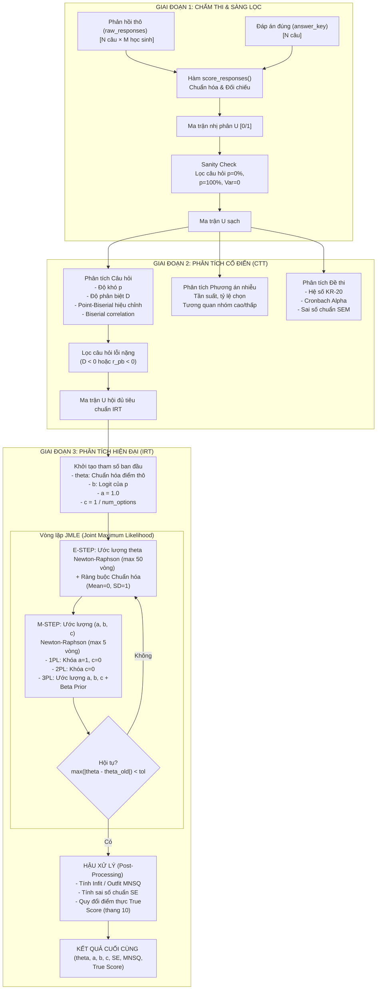

<p align="center">
  <a href="https://github.com/buithanhninh/rasch-irt">
    
  </a>
</p>

<h1 align="center">rasch-irt</h1>

<p align="center">
  <strong>Thư viện đo lường khảo thí cổ điển & hiện đại (CTT & IRT) hiệu năng cao dành cho Python.</strong>
</p>

<p align="center">
  <a href="https://github.com/buithanhninh/rasch-irt/blob/main/LICENSE">
    
  </a>
  <a href="https://www.python.org/">
    
  </a>
  <a href="https://github.com/psf/black">
    
  </a>
  <a href="https://github.com/buithanhninh/rasch-irt/pulls">
    
  </a>
</p>

<hr>

`rasch-irt` là một thư viện Python chuyên nghiệp, tối ưu hóa thuật toán phục vụ việc phân tích đánh giá chất lượng câu hỏi thi trắc nghiệm và năng lực thí sinh. Thư viện tích hợp đầy đủ hai cột trụ chính của khoa học đo lường giáo dục: **Lý thuyết Khảo thí Cổ điển (Classical Test Theory - CTT)** và **Lý thuyết Ứng đáp Câu hỏi (Item Response Theory - IRT)** với các mô hình 1PL (Rasch), 2PL, và 3PL sử dụng động cơ ước lượng tối ưu **JMLE (Joint Maximum Likelihood Estimation)** Newton-Raphson.

### 🌟 Tính năng nổi bật (Key Features)

*   ⚡ **Tốc độ & Hiệu năng**: Thiết kế tính toán ma trận vector hóa hoàn toàn trên NumPy và SciPy.
*   📐 **Mô hình IRT toàn diện**: Hỗ trợ 1PL (Rasch), 2PL và 3PL với hằng số chuẩn hóa $D=1.702$ nhất quán.
*   🛡️ **Thuật toán ổn định**: Ước lượng MAP với **Beta Prior** cho tham số đoán mò $c$ nhằm chống phân kỳ toán học.
*   📊 **Đầy đủ chỉ số kiểm định**: Tính toán Infit/Outfit MNSQ, Sai số chuẩn Fisher (SE), và kiểm định các tiên đề (Đơn hướng PCA, Độc lập cục bộ Q3).
*   🔍 **Phân tích CTT nâng cao**: Độ khó $p$, độ phân biệt $D$ (nhóm 27%), tương quan Point-Biserial hiệu chỉnh loại trừ trùng lặp (Henrysson 1963), và độ tin cậy KR-20 / Cronbach's Alpha.
*   🤖 **Lựa chọn mô hình tự động (Auto-Fit)**: Tự động so sánh và chọn mô hình tối ưu dựa trên AIC/BIC.

---

## 🗺️ Luồng xử lý dữ liệu (Data Flow)

`rasch-irt` tổ chức luồng dữ liệu khép kín từ lúc nhận phản hồi thô cho tới khi xuất báo cáo khảo thí hoàn chỉnh:



---

## 🇻🇳 TIẾNG VIỆT - HƯỚNG DẪN SỬ DỤNG

### 📦 1. Cài đặt (Installation)

Thư viện yêu cầu **Python >= 3.9** cùng với `numpy` và `scipy`. Bạn có thể cài đặt trực tiếp từ mã nguồn:

```bash
pip install .
```

### 📝 2. Quy trình Sử dụng E2E (Chấm thi → CTT → IRT)

#### Bước A: Chấm điểm tự động (`score_responses`)
Chuyển đổi ma trận phản hồi trắc nghiệm gốc dạng chữ cái (`'A', 'B', ...`) hoặc số sang ma trận nhị phân 0/1:

```python
import numpy as np
from rasch_irt import score_responses

# Phản hồi thô của 5 thí sinh làm bài thi 4 câu hỏi (Ký tự trống '' là bỏ qua)
raw_responses = np.array([
    ['A', 'B', 'A', 'D', ''],
    ['B', 'B', 'C', 'D', 'A'],
    ['C', 'A', 'D', 'C', 'C'],
    ['A', 'B', 'D', 'D', 'D']
])

# Đáp án chuẩn tương ứng
answer_key = np.array(['A', 'B', 'D', 'D'])

# Chấm thi tự động
U = score_responses(raw_responses, answer_key)
print("Ma trận nhị phân chấm thi U:\n", U)
```

#### Bước B: Phân tích Lý thuyết Cổ điển (`run_ctt`)
Đánh giá độ tin cậy của bài thi và lọc các câu hỏi lỗi trước khi phân tích mô hình IRT phức tạp:

```python
from rasch_irt import run_ctt

ctt_result = run_ctt(U, raw_responses=raw_responses, answer_key=answer_key)

print(f"Độ tin cậy bài thi KR-20: {ctt_result.kr20:.4f}")
print(f"Hệ số Cronbach's Alpha: {ctt_result.cronbach_alpha:.4f}")
print(f"Điểm trung bình thô: {ctt_result.mean_score:.2f}")
print("Các câu hỏi chất lượng kém đề xuất loại bỏ:", ctt_result.bad_items)
```

#### Bước C: Ước lượng mô hình IRT 1PL / 2PL / 3PL (`run_irt`)
Sử dụng thuật toán **JMLE Newton-Raphson** để tính toán năng lực thí sinh và tham số câu hỏi:

```python
from rasch_irt import run_irt, JMLEConfig

# Cấu hình ước lượng mô hình 3PL cho đề thi 4 phương án
config = JMLEConfig(
    model_type=3,       # 1 = 1PL (Rasch), 2 = 2PL, 3 = 3PL
    num_options=4,      # Số phương án để tính Beta Prior cho tham số đoán mò c
    max_iter=100,       # Số vòng lặp tối đa
    tol=0.001           # Sai số epsilon hội tụ
)

# Loại trừ các câu hỏi thô bị lỗi tính toán (D < 0 hoặc point-biserial tương quan âm)
excluded_indices = [idx - 1 for idx in ctt_result.bad_items]
U_clean = np.delete(U, excluded_indices, axis=0)

irt_result = run_irt(U_clean, config)

# Đọc kết quả câu hỏi (Item Parameters)
for item in irt_result.items:
    print(f"Câu {item.item_number} -> Phân biệt (a): {item.param_a:.2f}, Độ khó (b): {item.param_b:.2f}, Đoán mò (c): {item.param_c:.2f}")
    print(f"   SE_b: {item.se_b:.3f}, Infit MNSQ: {item.infit_mnsq:.2f} ({item.fit_flag})")

# Đọc năng lực thí sinh (Person Abilities)
for person in irt_result.persons:
    print(f"Thí sinh {person.student_code} -> Năng lực (theta): {person.theta:.2f}, Quy đổi thang 10: {person.true_score_10:.2f}")
```

---

## 🇬🇧 ENGLISH - COMPLETE DOCUMENTATION

### 📦 1. Installation

Install the library directly from the source directory:

```bash
pip install .
```

### 📝 2. E2E Data Flow (Scoring → CTT → IRT)

#### Step A: Scoring responses (`score_responses`)
Converts raw responses matrix into a binary matrix $U$ ($1$ for correct, $0$ for incorrect or missing):

```python
import numpy as np
from rasch_irt import score_responses

raw_responses = np.array([
    ['A', 'B', 'A', 'D', ''],
    ['B', 'B', 'C', 'D', 'A'],
    ['C', 'A', 'D', 'C', 'C']
])
answer_key = np.array(['A', 'B', 'D'])

U = score_responses(raw_responses, answer_key)
```

#### Step B: Classical Test Theory (`run_ctt`)
Evaluates test reliability (KR-20, Cronbach Alpha) and flags bad items:

```python
from rasch_irt import run_ctt

ctt_result = run_ctt(U)
print("KR-20 Reliability:", ctt_result.kr20)
print("Items recommended for exclusion:", ctt_result.bad_items)
```

#### Step C: Item Response Theory (`run_irt`)
Estimates parameters under 1PL, 2PL, or 3PL models:

```python
from rasch_irt import run_irt, JMLEConfig

config = JMLEConfig(model_type=3, num_options=4)
irt_result = run_irt(U, config)

for item in irt_result.items:
    print(f"Item {item.item_number} - Difficulty (b): {item.param_b:.2f}, Discrimination (a): {item.param_a:.2f}")
```

---

## 🧮 3. Đặc tả Thuật toán & Toán học (Mathematical Specifications)

### A. Phương trình Mô hình 3PL (3PL Model Probability)
Xác suất thí sinh $j$ có năng lực $\theta_j$ trả lời đúng câu hỏi $i$ có các tham số ($a_i, b_i, c_i$) được tính bằng:
$$P_i(\theta_j) = c_i + \frac{1 - c_i}{1 + e^{-D \cdot a_i(\theta_j - b_i)}}$$
Trong đó:
*   $b_i$: Tham số độ khó câu hỏi (Difficulty).
*   $a_i$: Tham số độ phân biệt câu hỏi (Discrimination). Cố định bằng $1.0$ trong mô hình 1PL.
*   $c_i$: Tham số đoán mò ngẫu nhiên (Guessing). Cố định bằng $0.0$ trong mô hình 1PL/2PL.
*   $D = 1.702$: Hằng số scaling đưa mô hình Logistic tiệm cận mô hình tích phân chuẩn Normal Ogive.

### B. Beta Prior cho Tham số Đoán mò $c$ (MAP Estimation)
Nhằm tránh việc ước lượng tham số đoán mò $c$ bị phân kỳ khi cỡ mẫu nhỏ, thư viện áp dụng phân phối **Beta Prior** làm MAP estimator:
$$\text{Beta}(\alpha, \beta)$$
Các tham số Prior tự động thiết lập dựa trên số lượng đáp án lựa chọn (`num_options`) của bài thi:
*   **4 phương án**: $E[c] = 0.25 \rightarrow \alpha = 5.0, \beta = 15.0$
*   **5 phương án**: $E[c] = 0.20 \rightarrow \alpha = 4.0, \beta = 16.0$
*   **3 phương án**: $E[c] = 0.33 \rightarrow \alpha = 6.6, \beta = 13.4$

### C. Chỉ số Trùng khớp (Fit Statistics MNSQ)
Đánh giá mức độ khớp giữa dữ liệu thực nghiệm và mô hình toán học:
$$\text{OUTFIT MNSQ} = \frac{1}{M}\sum_{j=1}^M \frac{(u_{ij} - P_{ij})^2}{W_{ij}}$$
$$\text{INFIT MNSQ} = \frac{\sum_{j=1}^M (u_{ij} - P_{ij})^2}{\sum_{j=1}^M W_{ij}}$$
Trong đó $W_{ij} = P_{ij}(1 - P_{ij})$ là phương sai kỳ vọng.
*   **MNSQ $\in [0.7, 1.3]$**: Câu hỏi chất lượng **Tốt** (Lý tưởng).
*   **MNSQ $> 1.3$**: Underfit (Dữ liệu bị nhiễu động cao hoặc có hiện tượng đoán mò).
*   **MNSQ $< 0.7$**: Overfit (Câu hỏi quá dễ đoán hoặc trùng lặp thông tin).

---

## 📜 LICENSE
Bản quyền phân phối mã nguồn thuộc về tác giả **Bùi Thành Ninh** (MIT License).
Thư viện được đóng gói chuyên nghiệp và sẵn sàng tích hợp hoặc công khai mã nguồn.
